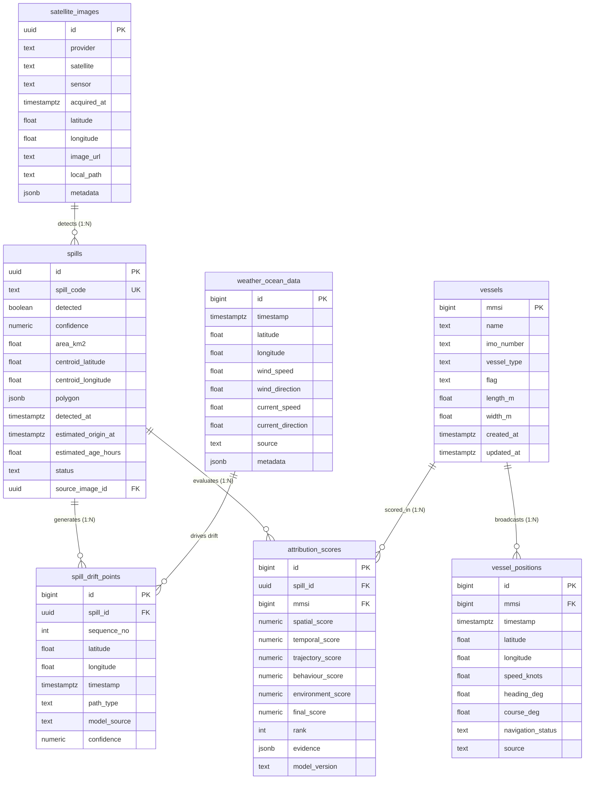

# OILTRACE — Database Layer Documentation & Specification

> **SIH Internal Hackathon • Marine Oil Spill Detection & Explainable Vessel Attribution**  
> **Role:** Data / DB Lead  
> **Target Engine:** PostgreSQL 14+ / Supabase  

---

## 1. Overview & Architecture

The **OILTRACE** database is the persistent data layer powering the end-to-end oil spill intelligence pipeline:
$$\text{Satellite SAR Spill Detection} \longrightarrow \text{Spill Geometry} \longrightarrow \text{Drift Hindcast/Forecast} \longrightarrow \text{AIS Vessel History} \longrightarrow \text{Attribution Scoring} \longrightarrow \text{FastAPI Backend} \longrightarrow \text{Frontend Dashboard}$$

---

## 2. File Directory

| File | Description |
| :--- | :--- |
| [`01_schema.sql`](file:///e:/Database/01_schema.sql) | DDL script defining all tables, constraints, indexes, triggers, and Supabase RLS policies. |
| [`02_seed_data.sql`](file:///e:/Database/02_seed_data.sql) | Realistic demo dataset for `SP-001`, candidate vessels (`VESSEL ALPHA`, `BRAVO`, `CHARLIE`), historical AIS tracks, drift points, and explainable AI attribution evidence. |
| [`03_verify_queries.sql`](file:///e:/Database/03_verify_queries.sql) | SQL test suite validating all Backend API endpoints, foreign keys, and data integrity constraints. |
| [`all_in_one_setup.sql`](file:///e:/Database/all_in_one_setup.sql) | Single-click SQL script for pasting into the Supabase SQL Editor. |
| [`BACKEND_HANDOFF.md`](file:///e:/Database/BACKEND_HANDOFF.md) | Official DB Lead hand-off document for the Backend Lead, containing field dictionaries and API integration guides. |
| [`.env.example`](file:///e:/Database/.env.example) | Environment variable template for database connectivity. |
| [`test_data_integrity.py`](file:///e:/Database/test_data_integrity.py) | Automated validation script testing SQL syntax, JSONB schema, and demo entities. |

---

## 3. Tables & Specifications

### Table: `spills` (MUST)
- **Primary Key:** `id` (`UUID DEFAULT gen_random_uuid()`)
- **Key Columns:**
  - `spill_code` (`TEXT UNIQUE`): Human-readable ID (e.g. `'SP-001'`).
  - `detected` (`BOOLEAN NOT NULL DEFAULT true`): Detection active flag.
  - `confidence` (`NUMERIC(5,4)`): Confidence score between `0.0` and `1.0`.
  - `area_km2` (`DOUBLE PRECISION`): Slick area in km².
  - `centroid_latitude`, `centroid_longitude` (`DOUBLE PRECISION`): Bounded coordinates.
  - `polygon` (`JSONB`): GeoJSON `Polygon` / `MultiPolygon` format for mapping rendering.
  - `detected_at` (`TIMESTAMPTZ`): Satellite observation time in UTC.
  - `estimated_origin_at` (`TIMESTAMPTZ`): Hindcast estimated discharge timestamp.
  - `status` (`TEXT`): `'detected'`, `'investigating'`, `'resolved'`, `'closed'`.
  - `source_image_id` (`UUID FK` $\rightarrow$ `satellite_images.id`).

### Table: `vessels` (MUST)
- **Primary Key:** `mmsi` (`BIGINT`): 9-digit AIS Maritime Mobile Service Identity.
- **Key Columns:** `name`, `imo_number`, `vessel_type`, `flag`, `length_m`, `width_m`, `created_at`, `updated_at`.
- **Trigger:** Automatic `updated_at` modification on update.

### Table: `vessel_positions` (MUST)
- **Primary Key:** `id` (`BIGINT GENERATED ALWAYS AS IDENTITY`).
- **Key Columns:** `mmsi` (`BIGINT FK` $\rightarrow$ `vessels.mmsi ON DELETE CASCADE`), `timestamp` (`TIMESTAMPTZ`), `latitude`, `longitude`, `speed_knots`, `heading_deg`, `course_deg`, `navigation_status`, `source` (`'sample_ais'`, `'real_ais'`, `'mock'`).
- **Indexes:** Indexed on `(mmsi)`, `(timestamp)`, `(mmsi, timestamp DESC)`, `(latitude, longitude)`.

### Table: `spill_drift_points` (MUST)
- **Primary Key:** `id` (`BIGINT GENERATED ALWAYS AS IDENTITY`).
- **Key Columns:** `spill_id` (`UUID FK` $\rightarrow$ `spills.id ON DELETE CASCADE`), `sequence_no` (`INTEGER`), `latitude`, `longitude`, `timestamp` (`TIMESTAMPTZ`), `path_type` (`'origin'`, `'historical'`, `'predicted'`), `model_source`, `confidence`.

### Table: `attribution_scores` (MUST)
- **Primary Key:** `id` (`BIGINT GENERATED ALWAYS AS IDENTITY`).
- **Key Columns:** `spill_id` (`UUID FK`), `mmsi` (`BIGINT FK`), `spatial_score`, `temporal_score`, `trajectory_score`, `behaviour_score`, `environment_score`, `final_score` (`NUMERIC(5,2)` $\in [0, 100]$), `rank` (`INTEGER`), `evidence` (`JSONB`), `model_version` (`TEXT`).
- **Constraint:** Unique `(spill_id, mmsi)`.

### Table: `satellite_images` (SHOULD)
- **Primary Key:** `id` (`UUID DEFAULT gen_random_uuid()`).
- **Key Columns:** `provider`, `satellite` (e.g. `'Sentinel-1A'`), `sensor` (e.g. `'SAR'`), `acquired_at` (`TIMESTAMPTZ`), `latitude`, `longitude`, `image_url`, `local_path`, `metadata` (`JSONB`).

### Table: `weather_ocean_data` (SHOULD)
- **Primary Key:** `id` (`BIGINT GENERATED ALWAYS AS IDENTITY`).
- **Key Columns:** `timestamp` (`TIMESTAMPTZ`), `latitude`, `longitude`, `wind_speed`, `wind_direction`, `current_speed`, `current_direction`, `source`, `metadata` (`JSONB`).

---

## 4. Setup Guide for Supabase

1. Open your [Supabase Dashboard](https://supabase.com/dashboard) and create a new project (e.g. `oiltrace-db`).
2. Navigate to the **SQL Editor** tab from the left sidebar.
3. Open [`all_in_one_setup.sql`](file:///e:/Database/all_in_one_setup.sql), copy the entire SQL script, paste it into the editor, and click **Run**.
4. To verify the setup, paste the queries from [`03_verify_queries.sql`](file:///e:/Database/03_verify_queries.sql) and run them.
5. In **Project Settings** $\rightarrow$ **Database**, copy the Connection URI and add it to your FastAPI `.env` file as `DATABASE_URL`.

---

## 5. Deliverables Checklist & Definition of Done

- [x] **Supabase / PostgreSQL SQL Schema** created with full DDL ([`01_schema.sql`](file:///e:/Database/01_schema.sql))
- [x] **Primary Keys, Foreign Keys, & Constraints** configured (`ON DELETE CASCADE`, coordinate bounds, score bounds $[0, 100]$, confidence $[0, 1]$)
- [x] **High-Performance Indexes** created for AIS trajectory queries, spill codes, and ranking searches
- [x] **Realistic Demo Dataset** inserted for `SP-001`, `VESSEL ALPHA` (top suspect), `VESSEL BRAVO`, `VESSEL CHARLIE`, drift hindcasts/forecasts, and explainable JSONB evidence ([`02_seed_data.sql`](file:///e:/Database/02_seed_data.sql))
- [x] **Backend API Verification Query Suite** created and verified ([`03_verify_queries.sql`](file:///e:/Database/03_verify_queries.sql))
- [x] **Backend Hand-off Documentation** prepared ([`BACKEND_HANDOFF.md`](file:///e:/Database/BACKEND_HANDOFF.md))
- [x] **Environment Variables Template** provided without exposing secrets ([`.env.example`](file:///e:/Database/.env.example))
